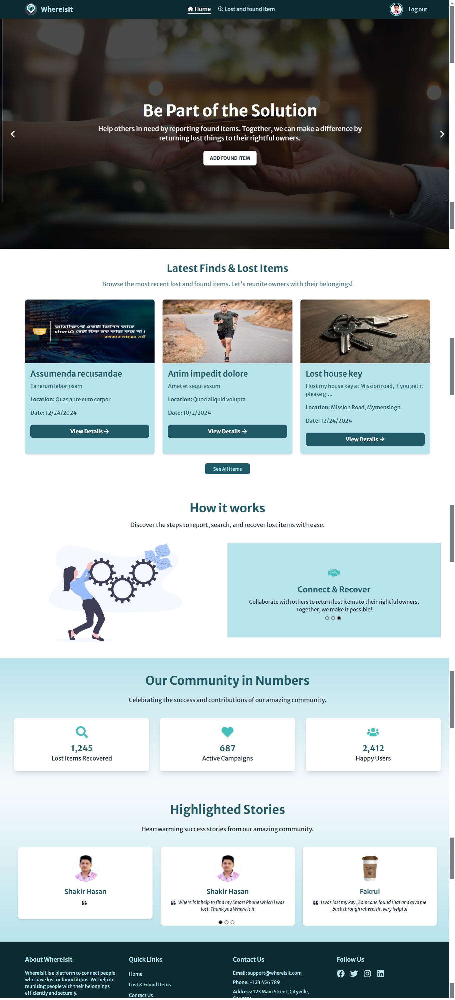

# WhereIsIt

A user-friendly Lost & Found web application to help people report, track, and recover lost items efficiently.

## 🌟 Live Demo

Check out the live version of the application [here](https://whereisit-by-shakir.netlify.app).

---

## 📚 Purpose

WhereIsIt is designed to bridge the gap between those who lose items and those who find them. By providing a streamlined platform, the application allows users to:

- Post details about lost items.
- Report found items.
- Recover items quickly and effectively.

---

## ✨ Key Features

1. **User Authentication**:

   - Login and register functionality.
   - Password reset option via email.

2. **Post Management**:

   - Add posts for lost or found items.
   - Filter posts by title.

3. **Item Categories**:

   - Browse categorized lost and found items.

4. **Recovered Items Section**:

   - Manage and view items recovered by the user.
   - Toggle between card and table layouts.

5. **Short Reviews**:

   - Write and submit reviews about your experience in 25 words.

6. **Responsive Design**:
   - Mobile-first, visually appealing, and user-friendly interface.

---

## 🛠️ Technologies Used

### Frontend

- **React.js**: Component-based UI framework.
- **React Router**: For seamless navigation.
- **Tailwind CSS**: For designing modern and responsive UI.
- **React Hot Toast**: For notifications and alerts.
- **Material Tailwind**: Enhanced UI components.

### Backend

- **Node.js**: Server-side runtime.
- **Express.js**: Web application framework.
- **MongoDB**: Database for managing data.

### Additional Tools

- **Lottie Animations**: For interactive visuals.
- **Helmet**: Dynamic page titles for SEO optimization.

---

## 📦 npm Packages Used

```bash
npm install react react-dom react-router-dom
npm install tailwindcss @material-tailwind/react react-hot-toast
npm install axios react-helmet
npm install @lottiefiles/react-lottie-player daisyui
```

## 📸 Screenshot

## 
